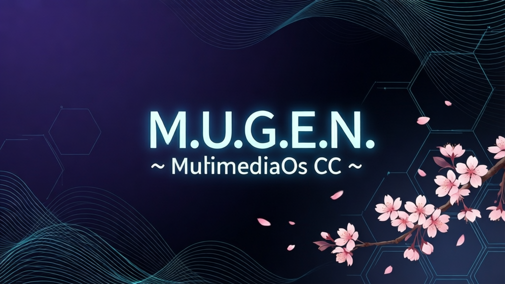
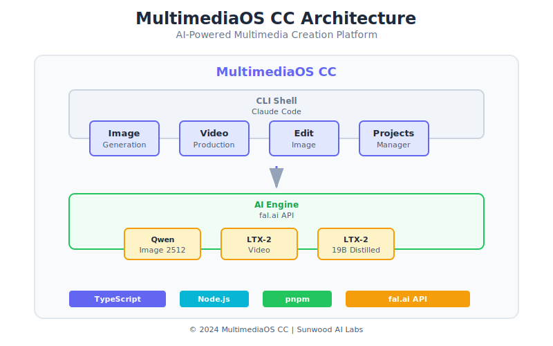

<div align="center">



# MultimediaOS CC ～M.U.G.E.N.～

### マルチメディア制作のためのオペレーティングシステム - Claude Code Edition

**M.U.G.E.N.** = **M**ultimedia **U**nlimited **G**eneration **E**ngine **N**exus

[](LICENSE)
[](https://github.com/Sunwood-ai-labs/MultimediaOS-MUGEN)
[](https://www.typescriptlang.org/)
[](https://fal.ai)

創造性を解き放つ、AI搭載のマルチメディア制作環境。

</div>

---

## What is MultimediaOS?

**MultimediaOS CC**（Claude Code Edition）は、マルチメディア制作のための**オペレーティングシステム**です。

単なるツールセットではなく、創造的な作業を効率化するための**統合プラットフォーム**。



### OSとしての機能

| 機能 | 説明 |
|:------:|------|
| **ファイルシステム** | プロジェクト別に制作環境を管理 |
| **CLIシェル** | 自然言語でシステムを操作 |
| **アプリケーション** | 画像生成、動画制作、画像編集 |
| **AIエンジン** | fal.ai APIによる高度な生成 |

---

## ✨ Features

### Image Generation

テキストから高品質な画像を生成。

**Model:** Qwen Image 2512
- リアルなテクスチャ生成
- 正確なテキスト描画
- 16:9ワイドスクリーン対応

```
「夕日の山脈の画像を作って」
「A serene Japanese garden at sunsetの画像を」
```

---

### Video Production

画像から動く動画を自動生成。

**Model:** LTX-2 / LTX-2 19B Distilled
- 高速な動画生成
- カメラ移動の制御
- 音声付き動画生成対応

```
「この写真から5秒の動画を作って」
「写真をズームインする動画にして」
```

---

### Image Editing

既存の画像を自然言語で編集。

**Model:** Qwen Image Edit 2511
- 直感的な編集指示
- 編集の強さを調整可能
- 自然な結果

```
「この写真の空を青くして」
「画像を編集して、くっきりさせる」
```

</div>

---

## Architecture

```
MultimediaOS/
├── kernel/                     # OSコア（Claude Code Skills）
│   └── .claude/skills/fal-ai/
│       ├── SKILL.md            # スキル定義
│       ├── scripts/            # アプリケーション
│       │   ├── generate-image.ts
│       │   ├── edit-image.ts
│       │   ├── image-to-video.ts
│       │   └── image-to-video-audio.ts
│       └── references/         # リファレンス資料
│
├── filesystem/                 # ファイルシステム
│   ├── projects/               # プロジェクトディレクトリ
│   │   └── my-project/
│   │       ├── inputs/         # 入力素材
│   │       ├── outputs/        # 生成物
│   │       └── prompts.md      # プロンプト履歴
│   └── outputs/                # グローバル出力
│       ├── images/
│       └── videos/
│
├── assets/                     # システムリソース
│   └── header.svg              # OSロゴ
│
└── .env                        # システム設定（APIキー）
```

---

## Installation

### Requirements

- Node.js 20+
- pnpm
- fal.ai API Key
- Claude Code

### Setup

1. **リポジトリをクローン**

```bash
git clone https://github.com/Sunwood-ai-labs/MultimediaOS-MUGEN.git
cd MultimediaOS-MUGEN
```

2. **APIキーを設定**

```bash
cp .env.example .env
# .envファイルにFAL_KEYを追加
```

3. **依存関係をインストール**

```bash
cd .claude/skills/fal-ai/scripts
pnpm install
```

4. **Claude Codeでスキルを読み込み**

```bash
# Claude Codeを起動
claude

# スキルが自動的に読み込まれます
```

---

## Usage

### CLIから実行

MultimediaOSは、Claude CodeのCLIから操作できます。

```
「サイバーパンクな夜の街の画像を作って」
「Qwen Image 2512で、夕日の山脈の画像を作って」
「この写真をサイバーパンク風に編集して」
「LTX-2で、この写真から5秒の動画を作って」
「写真を左から右にパンする動画にして」
```

### プロジェクト管理

プロジェクトごとに制作環境を分けることができます。

```bash
mkdir -p projects/my-new-project/{inputs,outputs}
cd projects/my-new-project
# プロジェクト内で制作開始
```

---

## Models

| Model | Type | Description |
|:------|:-----|:-----------|
| **Qwen Image 2512** | Image Generation | 高品質な画像生成、正確なテキスト描画 |
| **Qwen Image Edit 2511** | Image Editing | 自然言語による画像編集 |
| **LTX-2** | Video Generation | 高速な画像→動画変換 |
| **LTX-2 19B Distilled** | Video + Audio | 音声付き動画生成、カメラ制御 |

---

## Roadmap

- [ ] プロジェクト管理コマンドの追加
- [ ] プロンプトテンプレートシステム
- [ ] バッチ処理対応
- [ ] GUIフロントエンド
- [ ] プラグインシステム

---

## Contributing

私たちと一緒にMultimediaOSを向上させましょう！

1. フォークする
2. ブランチを作成 (`git checkout -b feature/amazing-feature`)
3. コミットする (`git commit -m 'Add amazing feature'`)
4. プッシュする (`git push origin feature/amazing-feature`)
5. プルリクエストを作成

---

## License

MIT License - see [LICENSE](LICENSE) for details.

---

## Acknowledgments

- [fal.ai](https://fal.ai) - API提供
- [Claude Code](https://claude.com/claude-code) - コーディングアシスタント
- [Qwen](https://qwenlm.github.io) - 画像生成・編集モデル
- [Lightricks](https://lightricks.com) - LTX-2動画モデル

---

<div align="center">

**MultimediaOS CC ～M.U.G.E.N.～** - 創造性を解き放つ、AI搭載のマルチメディア制作環境

Made with ❤️ by [Sunwood-ai-labs](https://github.com/Sunwood-ai-labs)

[GitHub](https://github.com/Sunwood-ai-labs/MultimediaOS-MUGEN) •
[Issues](https://github.com/Sunwood-ai-labs/MultimediaOS-MUGEN/issues) •
[Discussions](https://github.com/Sunwood-ai-labs/MultimediaOS-MUGEN/discussions)

</div>
